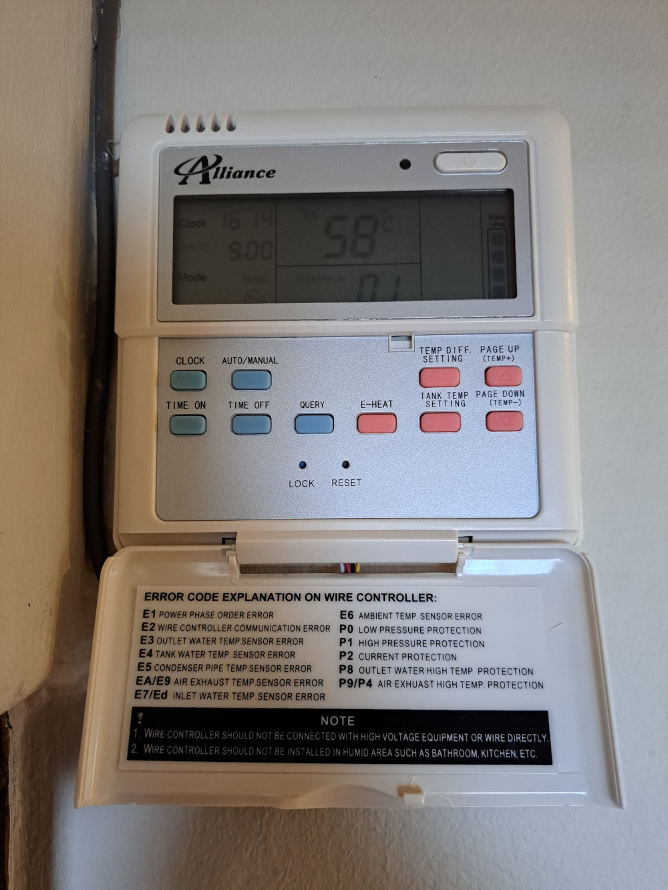
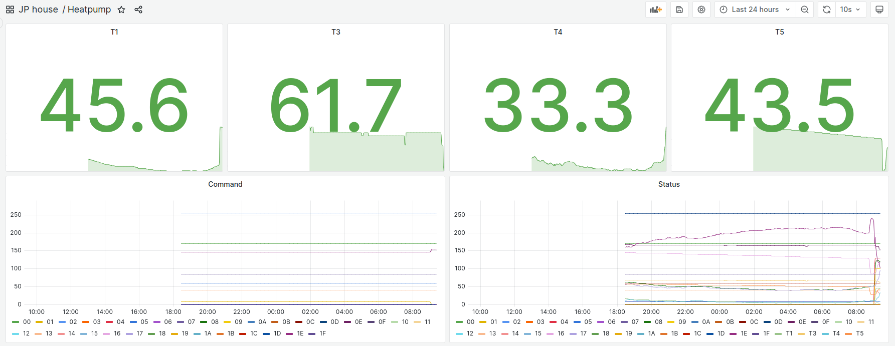
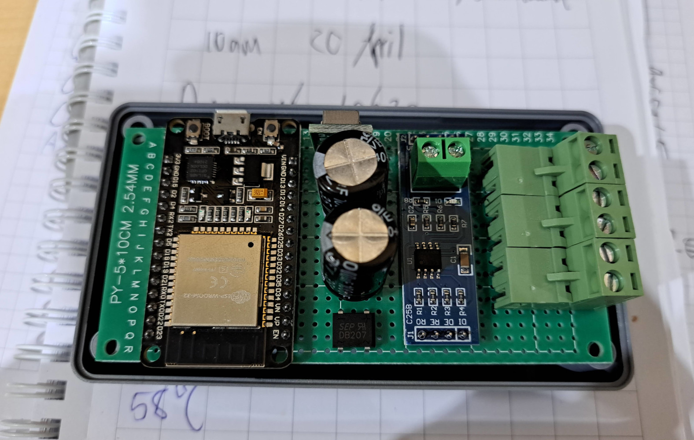

# Heat Pump Monitor

I have an Alliance Heat Pump with a wired control panel. Alliance seems to be rebranding Midea units. 

After sniffing the communication lines with a logic analyzer, I saw that it's a differential pair, like RS485. The request and answer frames start with 0xAA and end with 0x55. Searching for this I stumbled upon: https://codeberg.org/xye/xye

My heat pump's format is however slightly different, but the basics helped to find the correct decoding formula for temperatures. A 24h dump of raw data with my attempt at decoding the frames can be found in [this LibreOffice spreadsheet](FullDayDataDecoded.ods).

I programmed an ESP32 to listen to the RS485 bus and log all frames to MQTT. The firmware is available in the firmware directly in the repository. I write the data to Influxdb and plot the values using Grafana.

## Wired Remote Control
Model KJR-26B or SUNI-W/H-002

## Wiring

|Code |Colour|Purpose        |
|-----|------|---------------|
|AC10V|White |10Vac supply   |
|AC10V|Red   |10Vac supply   |
|P    |Brown |RS485 B-       |
|Q    |Black |RS485 A+       |
|E    |Yellow|Earth/Ground/0V|

## Request/Command

|Byte Nr|Purpose                                                                             |
|-------|------------------------------------------------------------------------------------|
|0x00   |Header. Always 0xAA.                                                                |
|0x01   |8 = schedule off, 0 = schedule on, 0x82 = ?? becomes this when status byte 4 is 0x88|
|0x02   |0xFF                                                                                |
|0x03   |0x00                                                                                |
|0x04   |0x00                                                                                |
|0x05   |Tank Temp Setting                                                                   |
|0x06   |Temp Diff Setting                                                                   |
|0x07   |0x00                                                                                |
|0x08   |0=??, 1=?? - seen as 1 at start of schedule on                                      |
|0x09   |0x00                                                                                |
|0x0A   |0x00                                                                                |
|0x0B   |0 = e-heat disabled, 0x01 = e-heat enabled                                          |
|0x0C   |0x00                                                                                |
|0x0D   |0x00                                                                                |
|0x0E   |0x00                                                                                |
|0x0F   |0x00                                                                                |
|0x10   |0x00                                                                                |
|0x11   |0x00                                                                                |
|0x12   |0x00                                                                                |
|0x13   |0x28                                                                                |
|0x14   |0x00                                                                                |
|0x15   |0x00                                                                                |
|0x16   |0x00                                                                                |
|0x17   |0x00                                                                                |
|0x18   |0x00                                                                                |
|0x19   |0x00                                                                                |
|0x1A   |0x00                                                                                |
|0x1B   |0x00                                                                                |
|0x1C   |0x00                                                                                |
|0x1D   |0x00                                                                                |
|0x1E   |Checksum = 256 - (sum(b1:b29)%256)                                                  |
|0x1F   |0x55                                                                                |

## Response/Status

|Byte Nr|Purpose                                                                                  |
|-------|-----------------------------------------------------------------------------------------|
|0x00   |Header. Always 0xAA.                                                                     |
|0x01   |0x01                                                                                     |
|0x02   |0x00                                                                                     |
|0x03   |0xFF                                                                                     |
|0x04   |0x08 = schedule off, 0x82 = schedule on, 0x88 = ?? after this command byte 1 becomes 0x82|
|0x05   |0x08                                                                                     |
|0x06   |0x00                                                                                     |
|0x07   |0x00                                                                                     |
|0x08   |T1 = byte/2 - 0x0F = outlet water temperature                                            |
|0x09   |0x00 = pump off, 0x64 = pump on (100%?)                                                  |
|0x0A   |0x00                                                                                     |
|0x0B   |0x00                                                                                     |
|0x0C   |0x00 except 0x20 when byte 4 is 0x82                                                     |
|0x0D   |0x00                                                                                     |
|0x0E   |T3 = byte/2 - 0x0F = evaporator temperature                                              |
|0x0F   |0x00                                                                                     |
|0x10   |Ia - pump amps?                                                                          |
|0x11   |0x00                                                                                     |
|0x12   |0x3C                                                                                     |
|0x13   |0x28                                                                                     |
|0x14   |0x00 = pump off, 0x20,0x22,0x24 = pump on - related to current temp diff                 |
|0x15   |0x00                                                                                     |
|0x16   |T5 = byte/2 - 0x0F = tank temperature                                                    |
|0x17   |T4 = byte/2 - 0x0F = environment temperature                                             |
|0x18   |0x01                                                                                     |
|0x19   |0x00 = pump off, 0x01 = pump on                                                          |
|0x1A   |0x00                                                                                     |
|0x1B   |0x00                                                                                     |
|0x1C   |Tank Temp Setting - follows command byte 0x05                                            |
|0x1D   |Command check = 0xFF - byte 0x01                                                         |
|0x1E   |Checksum = 256 - (sum(b0x01:b0x1D)%256)                                                  |
|0x1F   |0x55                                                                                     |

## Grafana

## Hardware

