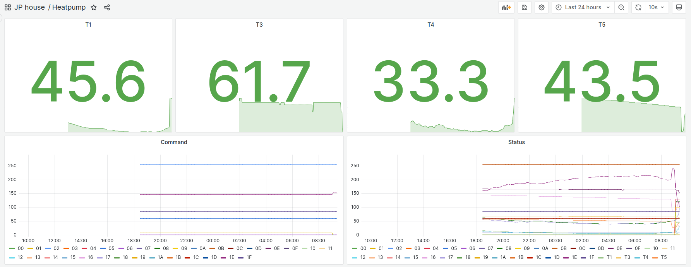

# Heat Pump Monitor

I have an Alliance Heat Pump with a wired control panel. Alliance seems to be rebranding Midea units. 

After sniffing the communication lines with a logic analyzer, I saw that it's a differential pair, like RS485. The request and answer frames start with 0xAA and end with 0x55. Searching for this I stumbled upon: https://codeberg.org/xye/xye

My heat pump's format is however slightly different, but the basics helped to find the correct decoding formula for temperatures. A 24h dump of raw data with my attempt at decoding the frames can be found in [this LibreOffice spreadsheet](FullDayDataDecoded.ods).

I programmed an ESP32 to listen to the RS485 bus and log all frames to MQTT. The firmware is available in the firmware directly in the repository. The data is written to Influxdb and I plot the values using Grafana.

