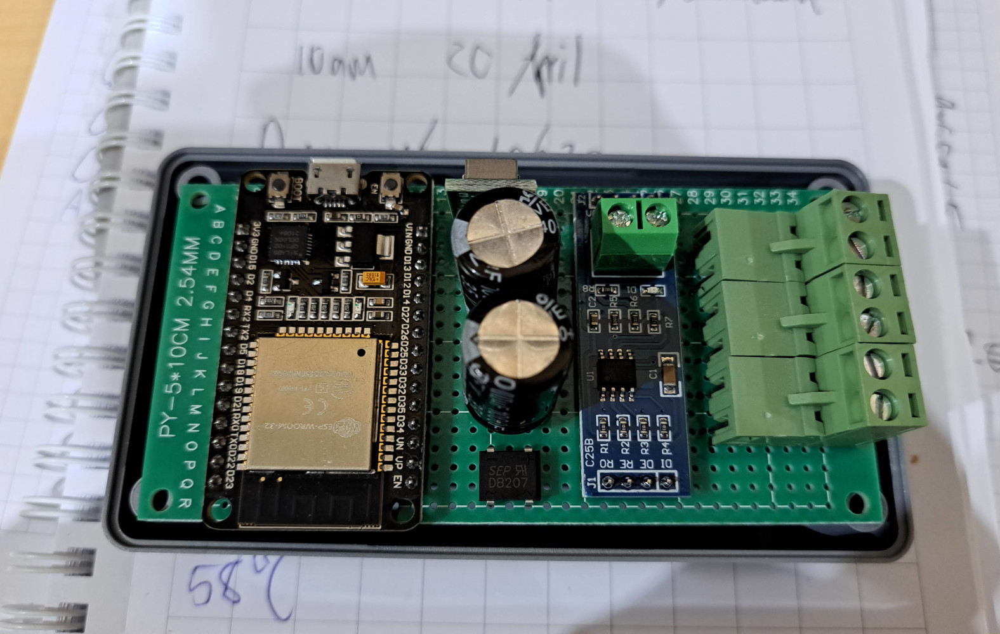
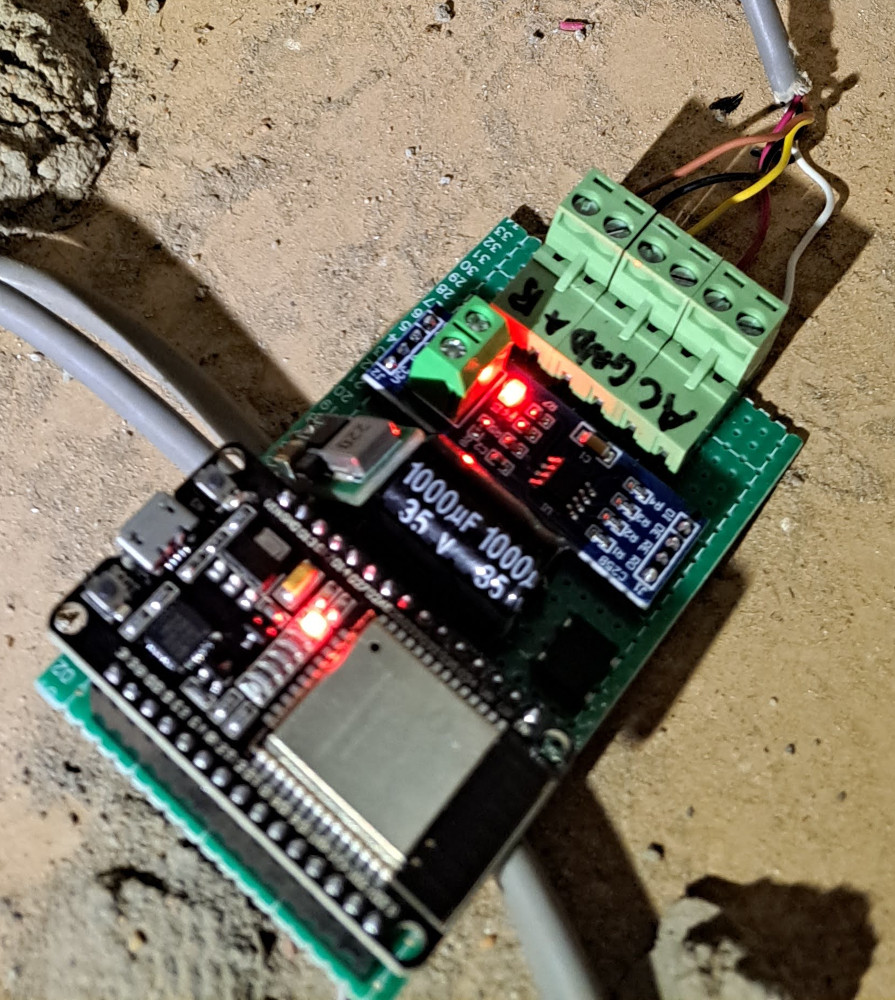

# Bill of materials

* [RS485 module](https://www.robotics.org.za/RS485-MOD)
* [ESP32 dev kit](https://www.robotics.org.za/ESP32-DEVKITC-32D)
* [Bridge rectifier](https://www.robotics.org.za/DB207-DIP)
* [5V regulator](https://www.robotics.org.za/5V1A-BUCK-REG)
* [Quick release screw terminal](https://www.robotics.org.za/YC100-508-2P-MF)
* [1000uF cap](https://www.robotics.org.za/1000UF-35V-4)
* [100nF cap](https://www.robotics.org.za/100NF-10)
* [Enclosure](https://www.robotics.org.za/P122-G)
* [Protoboard](https://www.robotics.org.za/PROTO-0510-254)

# Schematic

TODO

10Vac input via bridge rectifier, filtered with 1000uF cap, into 5V buck converter with 100nF caps on input and output.

5V into ESP32 Vin pin, as well as RS485 converter Vcc.

* `#define SER1_RX 35` - RS485 adapter RO
* `#define SER1_TX 32` - RS485 adapter DI
* `#define ENABLE 33` - RS485 adapter enable - bridged DE and RE.

# Photos

